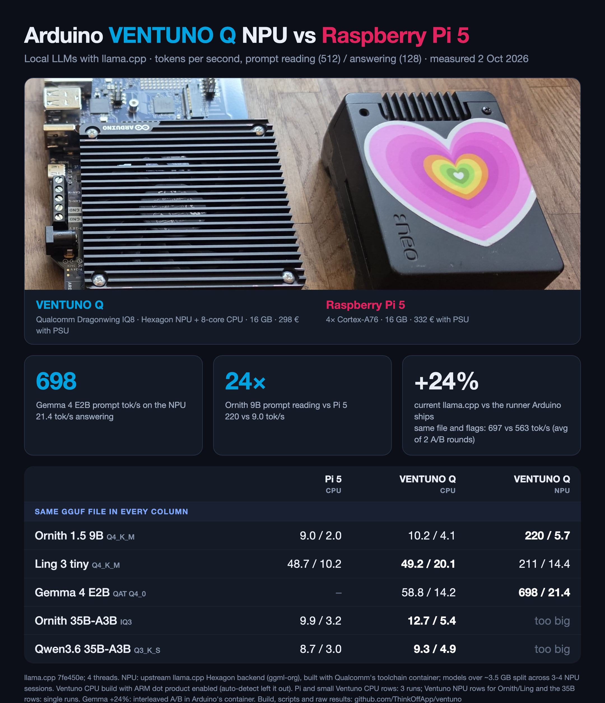

# Local LLMs on the Arduino VENTUNO Q NPU



Current upstream [llama.cpp](https://github.com/ggml-org/llama.cpp), built for the Qualcomm Hexagon NPU on the
[Arduino VENTUNO Q](https://www.arduino.cc/product-ventuno-q) (Qualcomm Dragonwing IQ8), and measured against the
board's own CPU and a Raspberry Pi 5. Measured on 2 October 2026.

| tok/s, prompt (512) / answering (128) | Pi 5 CPU | VENTUNO Q CPU | VENTUNO Q NPU |
|---|---|---|---|
| Ornith 1.5 9B, Q4_K_M | 9.0 / 2.0 | 10.2 / 4.1 | **220 / 5.7** |
| Ling 3 tiny, Q4_K_M | 48.7 / 10.2 | **49.2 / 20.1** | 211 / 14.4 |
| Gemma 4 E2B, QAT Q4_0 | – | 58.8 / 14.2 | **698 / 21.4** |
| Ornith 35B-A3B, IQ3 | 9.9 / 3.2 | **12.7 / 5.4** | does not fit |
| Qwen3.6 35B-A3B, Q3_K_S | 8.7 / 3.0 | **9.3 / 4.9** | does not fit |

Every row uses the same GGUF file in every column (SHA256s in [`results/ventuno/provenance.txt`](results/ventuno/provenance.txt)).
llama.cpp commit `7fe450e`, 4 threads, `llama-bench -p 512 -n 128`. Repetitions: Pi 5 and the smaller VENTUNO CPU rows 3,
Gemma on the NPU 3, the NPU rows for Ornith 9B and Ling 1, the 35B rows 1.

## What is ours and what is not

- **Upstream, not ours:** llama.cpp and its Hexagon NPU backend (ggml-org, with Qualcomm's contributions), and the
  Snapdragon toolchain container used to build it.
- **Ours:** building it for the VENTUNO Q, the install notes below, the measurements, and the findings:
  1. **Current llama.cpp is ~24% faster than the runner Arduino ships.** Gemma 4 E2B Q4_0, same file, same container
     (Arduino's `llamacpp-npu-runner:0.12.1`), same flags, only the llama.cpp build swapped, two interleaved rounds:
     697 vs 563 tok/s prompt, 20.7-22.1 vs 17.0-17.3 tok/s answering ([raw](results/ventuno/gemma-ab-same-container.txt)).
     The gain comes from upstream being newer than Arduino's bundled copy.
  2. **Arduino's bundled runner cannot load Ling 3** (`unknown model architecture: 'bailingmoe3'`); current llama.cpp can.
  3. **Build the CPU backend with dot product explicitly.** On this board GCC 13's `-mcpu=native` produced a build
     without ARM dot product (`HAVE_DOTPROD` empty), with no error. Prompt speed was 2.3x lower (Gemma 4 E2B Q4_K_M:
     11.9 vs 27.2 tok/s). Fix: `-DGGML_NATIVE=OFF -DGGML_CPU_ARM_ARCH=armv8.2-a+dotprod+fp16`.
  4. **Models over ~3.5 GB need several NPU sessions.** One session maps about 3.5 GB; larger models failed with
     `fastrpc_mmap failed` until split: `GGML_HEXAGON_DEVICES=3` (Ling 3 tiny) or `4` (Ornith 9B) with
     `-dev HTP0/HTP1/...`. A 13.7 GB model ran the 16 GB board out of memory.

## Use it

Prebuilt package: see [Releases](../../releases). Or build it yourself on any x86_64 Linux machine with Docker
(about 3 minutes):

```bash
./build/build-npu.sh
```

Then on the VENTUNO Q (no sudo needed; the `arduino` user can already reach the NPU):

```bash
./build/install-on-ventuno.sh pkg-linux-7fe450e.tgz
```

## Not measured yet

- Which layers of the K-quant models run on the NPU and which fall back to the CPU (needs a verbose run per model).
- Prompt on the NPU with answering on the CPU in one process (llama.cpp's op offload did not engage when the weights
  stay on the CPU).
- Repeated runs for the single-run rows.

## Files

- [`results/`](results/): raw `llama-bench` JSON and logs for every run, both boards, plus the driver scripts' logs.
- [`scripts/`](scripts/): the scripts that ran the VENTUNO passes.
- [`build/`](build/): NPU build and install.

MIT licensed (this repo's scripts and docs). llama.cpp is MIT licensed by its authors.
